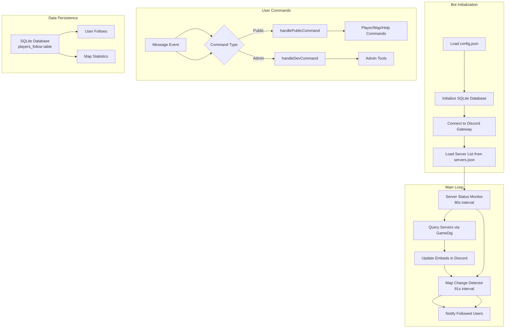

# Discord CS:GO Server Bot

A Discord bot that monitors Counter-Strike: Global Offensive (and other supported) servers, provides real-time server status updates, and notifies users when specific maps appear on followed servers.


## Features

### Public Commands

| Command | Description |
|---------|-------------|
| `--players` / `--p` | Display currently connected players on a specified server |
| `--map` / `--m` | Show the current map on a server or display map statistics |
| `--keywords` / `--keys` | List all available server keywords for searching |
| `--follow` / `--f` | Follow a map to receive DM notifications when it appears on a server |
| `--unfollow` / `--uf` | Stop following a specific map or all maps |
| `--listfollows` / `--lf` | Display all maps you are currently following |
| `--help` / `--commands` | Show a list of all available commands |
| `--ping` | Check bot latency (reacts with ping emoji) |
| `--version` / `--v` | Display the bot version |

### Administrator Commands

| Command | Description |
|---------|-------------|
| `--id` | Developer command |
| `--mem` | Display current memory usage statistics |
| `--check <IP>` | Check server status by IP address (with rate limiting) |
| `--listallfollows` / `--laf` | List all users and their followed maps |
| `--testnotify <map>` | Test map notification system |
| `--removeuser <userID>` | Remove all map follows for a specific user |

### Core Features

- **Real-time Server Monitoring**: Automatically queries CS:GO servers every 90 seconds to update server status
- **Map Notifications**: Receive DM alerts when followed maps appear on monitored servers
- **Multi-Game Mode Support**: Supports surf, KZ (climb), bhop, and retakes game modes
- **Rate Limiting**: Built-in rate limiting to prevent abuse (configurable per command)
- **IP Validation**: Secure IP address validation with private IP blocking
- **Automatic Cleanup**: Automatically removes user follows when they leave the server
- **Graceful Shutdown**: Proper database connection cleanup on SIGINT/SIGTERM
- **Caching System**: User and map image caching to reduce API calls
- **Retry Logic**: Exponential backoff for failed server queries

## Configuration

### Prerequisites

- **Node.js**: Version 20 or higher
- **Discord Bot Token**: Create a bot application at [Discord Developer Portal](https://discord.com/developers/applications)
- **SQLite**: Required for map follow data persistence (handled by `better-sqlite3` package)

### Setup Instructions

1. **Clone the repository**

   ```bash
   git clone https://github.com/Sneaks-Community/discordCSGOServerBot.git
   cd discordCSGOServerBot
   ```

2. **Install dependencies**

   ```bash
   npm install
   ```

3. **Configure the bot**
   - Copy the example configuration file:

     ```bash
     cp config.json.example config.json
     ```

   - Edit `config.json` with your settings (see [Configuration Options](#configuration-options) below)

4. **Run the bot**

   ```bash
   npm start
   ```

### Configuration Options

Create a `config.json` file based on `config.json.example`:

```json
{
  "discord": {
    "token": "YOUR_BOT_TOKEN_HERE",
    "prefix": "!",
    "intents": [
      "Guilds",
      "GuildMessages",
      "GuildMessageReactions",
      "DirectMessages",
      "DirectMessageReactions"
    ]
  },
  "security": {
    "adminUserIds": ["YOUR_DISCORD_USER_ID_1", "YOUR_DISCORD_USER_ID_2"]
  },
  "logging": {
    "enabled": true,
    "guildID": "YOUR_LOG_GUILD_ID",
    "channelID": "YOUR_LOG_CHANNEL_ID"
  },
  "fallback": {
    "guildID": "YOUR_FALLBACK_GUILD_ID",
    "channelID": "YOUR_FALLBACK_CHANNEL_ID"
  },
  "serverUpdate": {
    "intervalSeconds": 90,
    "mapCheckIntervalSeconds": 91,
    "maxConcurrentQueries": 10
  },
  "follow": {
    "timeoutSeconds": 30
  },
  "embeds": [
    {
      "channelID": "YOUR_EMBED_CHANNEL_ID",
      "messageID": "YOUR_EMBED_MESSAGE_ID"
    }
  ],
  "cache": {
    "userCacheTTLSeconds": 300,
    "mapImageCacheTTLSeconds": 86400
  },
  "retry": {
    "maxRetries": 3,
    "baseDelaySeconds": 1
  },
  "gamedig": {
    "defaultMaxRetries": 4
  },
  "embedsConfig": {
    "color": 7980240
  },
  "images": {
    "fallbackAvatar": "https://i.imgur.com/cBiDnMi.png",
    "offlineServer": "https://i.imgur.com/WnS0Biz.png"
  },
  "mapUrls": {
    "surf": {
      "stats": "https://snksrv.com/surfstats/",
      "image": "https://bans.snksrv.com/images/maps/"
    },
    "kz": {
      "stats": "https://snksrv.com/kzstats/#/maps/",
      "image": "https://raw.githubusercontent.com/KZGlobalTeam/map-images/public/images/"
    },
    "bhop": {
      "stats": "https://snksrv.com/bhopstats/index.php?map=",
      "image": "https://bans.snksrv.com/images/maps/"
    }
  }
}
```

### Configuration Fields

| Field | Type | Required | Default | Description |
|-------|------|----------|---------|-------------|
| `discord.token` | string | Yes | - | Your Discord bot token |
| `discord.prefix` | string | Yes | `!` | Command prefix for the bot |
| `discord.intents` | array | Yes | - | Discord gateway intents required for bot functionality |
| `security.adminUserIds` | array | Yes | - | Discord user IDs with access to admin commands |
| `logging.guildID` | string | Yes | - | Guild ID for logging bot activities |
| `logging.channelID` | string | Yes | - | Channel ID for logging bot activities |
| `embeds` | array | Yes | - | Array of channel/message pairs for embed updates |
| `serverUpdate.intervalSeconds` | number | No | `90` | How often to update server status (seconds) |
| `serverUpdate.mapCheckIntervalSeconds` | number | No | `91` | How often to check for map changes (seconds) |
| `serverUpdate.maxConcurrentQueries` | number | No | `10` | Maximum concurrent server queries |
| `follow.timeoutSeconds` | number | No | `30` | Timeout for reaction collectors (seconds) |
| `cache.userCacheTTLSeconds` | number | No | `300` | User cache TTL (seconds) |
| `cache.mapImageCacheTTLSeconds` | number | No | `86400` | Map image cache TTL (seconds) |
| `retry.maxRetries` | number | No | `3` | Maximum retry attempts for failed operations |
| `retry.baseDelaySeconds` | number | No | `1` | Base delay for retry exponential backoff (seconds) |
| `gamedig.defaultMaxRetries` | number | No | `4` | Default retry attempts for server queries |

## Supported Game Modes

The bot supports the following CS:GO game modes with automatic map detection:

### Surf Maps

- **Prefix**: `surf_`
- **Stats URL**: [snksrv.com/surfstats](https://snksrv.com/surfstats/)
- **Example**: `surf_beginner`

### KZ (Climb) Maps

- **Prefixes**: `kz_`, `bkz_`, `kzpro_`, `skz_`, `vnl_`, `xc_`
- **Stats URL**: [snksrv.com/kzstats](https://snksrv.com/kzstats/)
- **Example**: `kz_asylum`

### Bhop (Bunnyhop) Maps

- **Prefix**: `bhop`
- **Stats URL**: [snksrv.com/bhopstats](https://snksrv.com/bhopstats/)
- **Example**: `bhop_strix`

## Server Configuration

Add your CS:GO servers to `servers.json`:

```json
{
  "ServerName": {
    "ip": "IP_ADDRESS:PORT",
    "nick": "Display Name",
    "show": true,
    "protocol": "csgo",
    "keywords": ["keyword1", "keyword2"]
  }
}
```

### Server Fields

| Field | Type | Required | Description |
|-------|------|----------|-------------|
| `ip` | string | Yes | Server IP and port (e.g., `216.52.143.73:27015`) |
| `nick` | string | Yes | Display name shown in embeds |
| `show` | boolean | Yes | Whether to display server in public commands |
| `protocol` | string | No | Game protocol (default: `csgo`) - see list [here](https://github.com/gamedig/node-gamedig/blob/master/GAMES_LIST.md)|
| `keywords` | array | Yes | Search keywords for the server |

## Minimum Requirements

### System Requirements

**Node.js** v20.x

### Discord Bot Requirements

- **Bot Permissions**:
  - Send Messages
  - Embed Links
  - Read Message History
  - Add Reactions
  - Send Messages in Threads
  - Use External Emojis

- **Required Intents**:
  - Guilds
  - GuildMessages
  - GuildMessageReactions
  - DirectMessages
  - DirectMessageReactions

## Architecture



## Rate Limiting

The bot implements rate limiting to prevent abuse:

| Command | Limit | Window |
|---------|-------|--------|
| `--follow` | 5 actions | per minute |
| `--unfollow` | 5 actions | per minute |
| `--check` (IP) | 10 actions | per minute |

## Security Features

- **IP Validation**: Validates IPv4 and IPv6 addresses before querying
- **Private IP Blocking**: Prevents scanning of internal network addresses
- **SQL Injection Prevention**: Parameterized queries for all database operations
- **Map Name Sanitization**: Validates and sanitizes map name inputs
- **Mention Prevention**: Blocks user/role mentions in map names
- **Admin-Only Commands**: Restricted admin commands via user ID whitelist

## Error Handling

- **Retry Logic**: Exponential backoff for failed server queries and Discord API calls
- **Graceful Degradation**: Continues operation even if individual servers fail to respond
- **Fallback Notifications**: Sends notifications to fallback channel if DM fails
- **Memory Management**: Automatic cache cleanup and database connection handling

## Troubleshooting

### Bot won't start

First and foremost, **review all logs**.

- Verify your Discord token is correct and has proper permissions
- Check that `config.json` exists and is valid JSON
- Ensure all required configuration fields are present

### Commands not working

- Verify the command prefix matches your configuration
- Check that the bot has proper channel permissions
- Ensure your user ID is in the `adminUserIds` list for admin commands

### Map notifications not working

- Verify `follow.timeoutSeconds` is set appropriately
- Check that the bot can send DMs to users
- Ensure map names match the expected format (alphanumeric, underscores, hyphens)

### Server status not updating

- Check server IP and port in `servers.json`
- Verify the server is accessible from your network
- Review logs for GameDig query errors

## Contributing

1. Fork the repository
2. Create a feature branch
3. Make your changes
4. Test thoroughly
5. Submit a pull request

## License

This project is licensed under the ISC License.

## Author

**Frumpy7**

## Support

For issues and feature requests, please visit the [GitHub Issues](https://github.com/Sneaks-Community/discordCSGOServerBot/issues) page.

---

*Last Updated: 2026-03-07*
